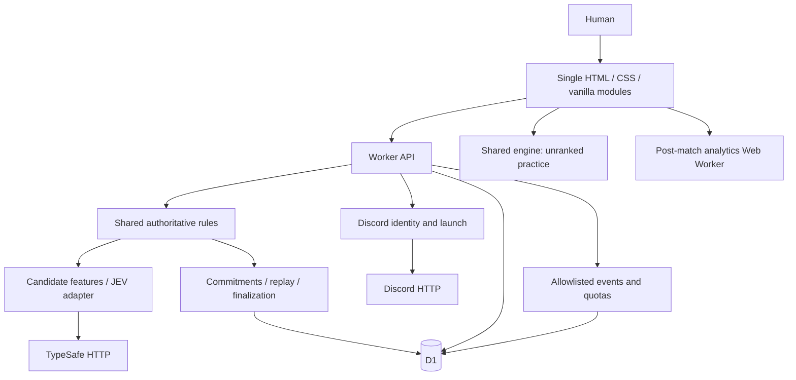
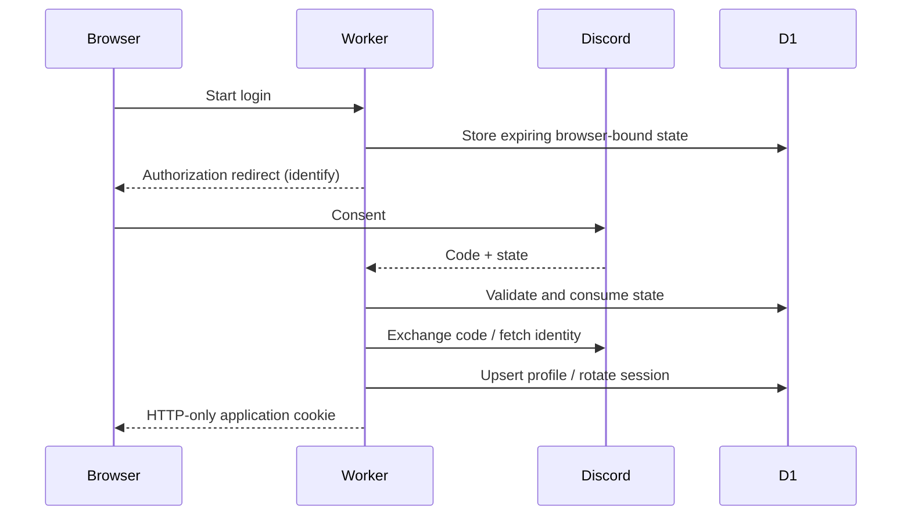
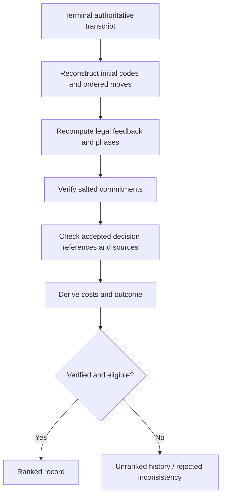
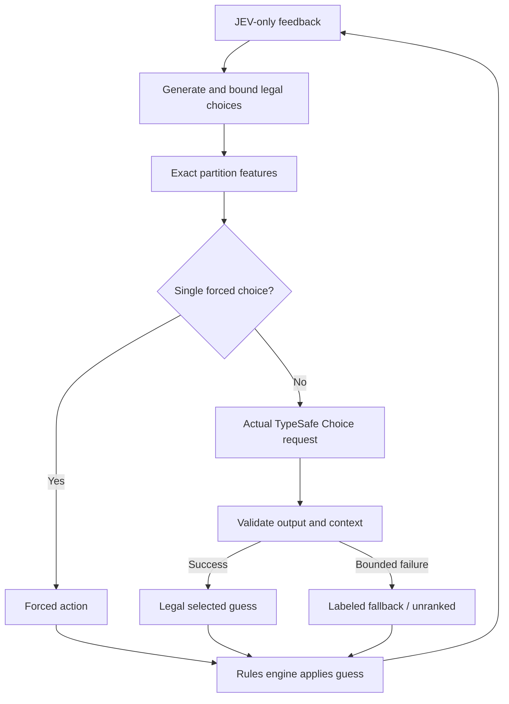

# Architecture and implementation status — A through Z

This document summarizes the implemented design. The original planning brief is preserved under `prompts/`; it is source material, not executable configuration.

## A. Game Interpretation

Two legs, human breaks first and JEV second. Four positions, six symbols A–F, repeats allowed, ten guesses, no timer-based score. Human code choice is part of codemaker skill; the two legs are not a same-secret speed race.

## B. Player Experience

Choose a code and difficulty, play locally or through a configured JEV server, finish both legs, inspect exact post-match analysis, export data/replay, view retained records and permitted leaderboards. Discord login enables identity, not automatic ranked conversion of earlier guest games.

## C. Game Rules Engine

`rules.js` is pure and DOM/network independent. It defines validation, action encoding, duplicate-safe feedback, immutable transitions, terminal outcomes, views, serialization and replay reconstruction. Secrets are a separate argument to authoritative transitions, not fields in the public game state. One shared engine serves UI practice, server, verifier and benchmark.

## D. JEV Decision Model

The engine filters possible secrets and calculates numeric partitions; JEV chooses from supplied candidates. Easy samples up to eight consistent guesses. Normal samples up to 32 with exact features. Hard evaluates all untried codes and supplies up to 64 expected-remaining candidates. JEV level minimax-filters and caps at 128. Final attempts restrict choices to consistent possible secrets. One possible action is forced. Bounded failures use the lowest untried consistent code and remove ranked eligibility.

## E. JEV State Encoding

One structured TypeSafe Choice question maps action IDs to candidate features. The state includes only the opponent's feedback history and attempt metadata. Strict response validation checks model, choice membership, maximum probability, complete probability map and confidence. Deterministic tie handling uses numeric ID. The accepted action and request hash are recorded; a replay never asks the provider to choose again.

## F. Architecture

The included Node loopback adapter runs the same handler against native SQLite and static files, with ranked play forcibly disabled. It is a development convenience, not an extra production service.

## G. Security Boundaries

The browser, local storage, URL parameters, player moves and provider answers are untrusted. Sessions, signatures, secret storage, authoritative transitions, score verification and leaderboard eligibility are server-side. The separate security document specifies controls and limits.

## H. Discord Authentication

## I. Discord Context

A signed guild `/play` interaction mints a five-minute personal launch ticket. Redemption requires the same OAuth identity and produces a fifteen-minute context snapshot. Guild/channel IDs from the browser are never trusted. Public website matches are World-only unless started from a verified context.

## J. Scoring

Solved leg cost is its guesses; failed leg costs 11. Lower codebreaking cost wins. Equal costs draw, including two failed legs. Forfeit is a separate loss with human penalized cost 11 and no fabricated JEV result.

## K. Leaderboards

Top-50 World/Server/Channel cohorts separate exact opponent configuration and difficulty. Match points percentage ranks established users after ten games; fewer average penalized guesses then more games break ties; equal metrics share ranks. Local/fallback/imported games do not qualify.

## L. Data Model

The actual migration creates six small tables: users, sessions, launch tickets, matches, analytics events, usage buckets. The last two are justified additions to the original four-table sketch: exhaustive observability and durable cross-isolate spend/rate limits. Actions, commitments, summaries, audits, timings, receipts and lease state remain inside bounded match records rather than a sprawling event-sourcing framework.

## M. API

The API document defines creation, authorized actions, OAuth, launch redemption, replay, account/community analytics and rankings. There is no score-submission endpoint. Duplicate action receipts return the latest authoritative snapshot rather than an old cached response.

## N. Anti-Cheat / Verification

## O. Replay Format

`jev-replay-v1` records game/rules/config/difficulty, match ID, commitments, revealed codes/salts, ordered compact guess IDs and sources, finish reason and expected outcome. The browser/CLI verifier proves internal consistency only. JEV requests need not be rerun, and imported files can never create official results.

## P. UI Layout

Desktop uses two boards, a setup/guess composer, compact structured evidence, and separate in-page tabs for analytics, record, leaderboards and benchmarks. Mobile stacks boards without viewport overflow. Letter labels make the game usable without color discrimination. Keyboard, focus and reduced-motion handling are included. SVG charts and data tables expose the same values.

## Q. File Structure

`public/` is the static UI and shared engine/analytics modules. `server/` contains the small API and platform integrations. `schema/` owns D1 migration; `tests/` owns independent verification; `bench/` owns simulations; `scripts/` owns explicit operational commands; `docs/` and `reports/` hold specifications/evidence. Additional games can reuse platform boundaries without importing Mastermind state logic.

## R. Dependencies

No browser or Node local-runtime packages. Wrangler is optional development/deployment tooling; Playwright is optional browser-test tooling. TypeSafe and Discord are real HTTP integrations, not bundled SDKs. The Python DOM harness exists solely to record tests in a browser-policy-restricted environment and is not an application dependency.

## S. Tests

Native tests cover rules, features, analytics, complete server matches, leakage, malformed/provider failure responses, OAuth state, signatures, context, idempotency, concurrent/stale calls, source eligibility, shared rankings, cohort isolation and quotas. Independent finite enumeration checks every feedback pair. A conventional HTTP Playwright suite is supplied, with its unperformed status distinguished from executed offline-DOM checks.

## T. JEV Benchmark Plan

The executable harness covers deterministic selector ablations, scripted minimax/expected baselines, seeded random baselines, and opt-in real JEV. Paired comparisons use matched secrets. Included live-provider count is zero; local results do not measure the model's contribution. A live run and corresponding deterministic ablation are required for that claim.

## U. Deployment

One Worker, static assets, D1, Discord application and optional live TypeSafe key. A cron performs bounded recovery and retention. Actual platform settings and secrets remain operator-provided. No deployment was carried out on the user's behalf.

## V. Implementation Phases

Pure rules → local interface → authoritative storage → candidate/JEV adapter → recovery/replay → Discord OAuth → signed context → ranked analytics → interface/accessibility → benchmarks → staging. These source layers are implemented; external staging validation is a release gate rather than a claimed completed deployment phase.

## W. Risks and Open Questions

Measured difficulty ordering can depend on whether mean or worst-case guesses are valued. Local Hard has a better measured mean than local JEV, while local JEV has a better measured worst case. Human-selected codes need not follow the uniform benchmark. Real model reliability and platform limits remain unmeasured here. External assistance and membership revocation limitations remain explicit.

## X. Simplification Pass

No frontend framework, SDK, ORM, Redis, WebSocket, persistent bot, custom launch JWT, message queue, social feed, Elo, tournament system or generalized game-plugin framework. Full counterfactual analysis stays out of ranked authority and runs off the main browser thread. Six tables meet the actual state/analytics/quota needs.

## Y. MVP Definition

The runnable local game, actual live-JEV boundary, four policies, complete post-match analytic exports, server-held codes, verifiable replay, Discord identity/context, three scoped standings, history, recovery and tests are implemented. Public availability additionally requires credentials, deployment, production browser checks and the operator's privacy/retention policy.

## Z. Next Implementation Step

Run `npm test` and `npm start` from this package. For release, provision a separate staging D1/Worker and Discord application, execute the live-provider/OAuth/launch/browser checklist with rankings disabled, then enable rankings only after those checks succeed. Future behavior changes must bump rules/prompt/policy versions so incompatible results do not share a cohort.
