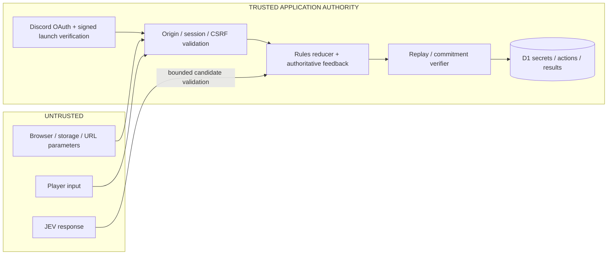

# Security and trust model

## Trust boundary

JEV is an external decision source, not trusted database authority. Only a validated candidate can become a legal reducer action. The browser never submits a score. Live provider confidence cannot authorize moves or override rules.

## Controls implemented

- Secret targets and salts remain on the server until termination. Both codes are committed before the human starts; salted hashes prevent enumeration of the small code domain from a public unsalted hash.
- Public and JEV views are explicit projections. Tests mutate hidden information and inspect provider request bodies for leaks.
- Production cookies use `__Host-jev`, `Secure`, `HttpOnly`, `SameSite=Lax`, and `/`; sessions store token hashes. The session is rotated after OAuth.
- Browser writes check origin, fetch-site and a session CSRF secret. OAuth uses browser-bound, expiring single-use state. Provider access/refresh tokens are discarded after identity fetch.
- Discord signatures validate original raw bytes and timestamp. Launches bind one user, guild, channel, application, interaction ID and expiry; duplicate interactions do not mint unlimited links.
- SQL is parameterized. Usernames are rendered with `textContent`; no profile HTML is evaluated. CSV string formula triggers are neutralized.
- Request bodies, IDs, action fields, model/choice/probability maps, candidates and stored receipts are bounded and validated.
- Compare-and-swap revisions and durable AI leases prevent duplicate or stale updates. Resignation invalidates a pending AI response. Identical HTTP retries do not consume additional turns.
- Persistent quota reservations constrain starts and model spending across concurrent Worker isolates. Logs use an explicit allowlist with no raw IP/credential/secret capture.
- Replay verification reconstructs outcome and costs from accepted actions and checks the original commitments before finalization. Fallback/local matches cannot rank.
- CSP limits scripts/styles/connect/workers to self, with separate image allowance; frame embedding and referrers are restricted. Headers are tested; a real deployed browser pass is still required.

## What is not proved or prevented

External human solver assistance, multi-account farming, account sharing, compromised infrastructure, a malicious administrator changing authoritative data, fresh remote-model determinism, and immediate Discord membership revocation are not solved by these controls. A replay's internal validity does not prove official server provenance, and no imported replay can update rankings.

The application stores active secrets in its private database; it does not implement custom field-level encryption. Use the platform's access controls, transport encryption, storage protection and backup controls. This code has not received an independent penetration test or a production security certification.

Cloudflare-specific D1 runtime behavior, provider response contract stability, Discord registration/authorization and normal-origin browser enforcement must be validated in staging. Keep a small bounded population until actual telemetry supports larger limits. Retain and display deployment/privacy information before inviting public users.

## Release gate

Run native/exhaustive/browser tests; establish real provider and Discord fixtures in staging; verify hidden fields are absent with browser devtools; inspect no secrets in events; test concurrent/retried requests; confirm external fallback disables eligibility; review D1 access and restore; publish data-retention/deletion policy; then enable ranked mode.
